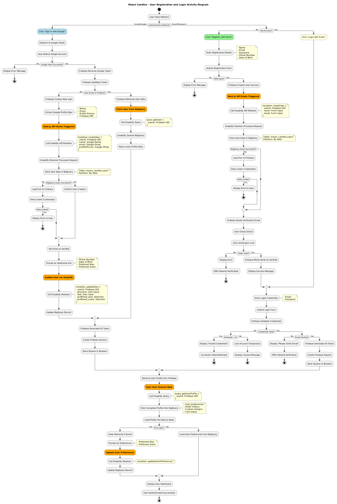
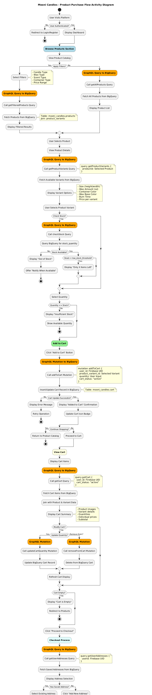
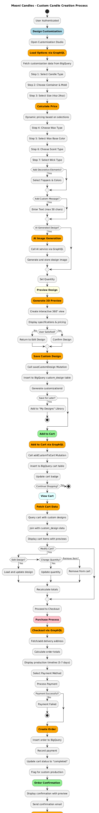

# Mooni Candles – E-Commerce Platform

Mooni Candles is a modern candle-shop platform where users can buy handcrafted candles, design personalized scents, and interact with an AI-powered shopping assistant. This project combines e-commerce, generative AI, and smart recommendations to create a fully customizable candle-buying experience.

## Class Diagram

* A class diagram is a structural diagram in Unified Modeling Language (UML) that shows the static structure of a system by depicting classes, their attributes, methods, and relationships.

* Class diagrams visualize the blueprint of an object-oriented system before implementation begins.

* Class diagrams consist of classes (represented as rectangles), attributes (data fields), methods (functions), and relationships (lines connecting classes).

* When applied to database design, class diagrams represent tables as classes, columns as attributes, and foreign key relationships as associations.

* Primary Keys (PK): Uniquely identify each record in a table and are underlined or marked with "PK" notation.
* Foreign Keys (FK): Reference primary keys in other tables, establishing relationships between entities and marked with "FK" notation.

* Specify the kind of data each attribute holds (VARCHAR for text, INT for integers, etc.).

* Lines connecting classes show how entities relate (one-to-one, one-to-many, many-to-many associations).

* Indicates how many instances of one entity relate to instances of another (e.g., one user has many orders).

Mooni Candles E-Commerce Platform Class Diagram Analysis

## Core Entities

### USER Table

Stores customer account information including credentials, contact details, and preferences for wax and scent types.

USER (userid, name, email, password, phoneno, dob, preffered_wax, preffered_scent)

### ADDRESS Table

Contains shipping and billing address information linked to users through userid foreign key.

ADDRESS (addressid, userid, label, line1, line2, city, state, country, postal_code)

### PRODUCT Table

Maintains catalog of candle products with basic attributes like name, image, type, and wax characteristics.

PRODUCT (productid, product_name, imageurl, candle_type, wax_type, scent_type, container_type)

### PRODUCT_VARIANT Table

Stores specific variations of products with details on dimensions, wax amount, wick, container specifications, and inventory levels.

PRODUCT_VARIANT (product_variantid, productid, product_variant_name, height_width_inches, wax_amount_oz, wick_type, container_color, wax_base_color, burn_time_hours, stock_quantity, low_stock_threshold)

### CUSTOM_DESIGN Table

Captures user-created custom candle designs with personalized attributes for container, wax, scent, and wick preferences.

CUSTOM_DESIGN (customizationid, userid, message_on_container, ai_generated_image, candle_type, wax_type, wax_base_color, scent_type, container_type, container_mould_type, container_color, height_width_inches, wax_amount_oz, wick_type, quantity, price, burn_time_hours, topper_mould_type, topper_wax_color)

### CART Table

Manages shopping cart functionality linking users to product variants and custom designs with quantity tracking.

CART (cartid, user_id, customization_id, product_variant_id, quantity, cart_status)

### ORDER Table

Records completed purchases with user, address, cart reference, pricing breakdown, and fulfillment status.

ORDER (orderid, userid, addressid, cartid, order_created_at, order_status, subtotal_amount, tax_amount, shipment_amount, total_amount, shipment_location)

### PAYMENT Table

Handles transaction records associated with orders including payment method, status, and currency information.

PAYMENT (paymentid, orderid, payment_status, payment_method, currency, payment_msg)

### REVIEW Table

Stores customer feedback on products and orders with ratings and text comments.

REVIEW (reviewid, userid, productid, orderid, rating, title, body)

## Activity Diagram

An activity diagram is a behavioral diagram in Unified Modeling Language (UML) that illustrates the dynamic flow of activities, decisions, and actions within a system or process.

* Activity diagrams visualize the workflow or process logic before implementation begins.

* Activity diagrams consist of actions (rounded rectangles), control flows (arrows), decisions (diamonds), forks/joins (parallel bars), and start/end nodes (solid and hollow circles).

* When applied to system design, activity diagrams represent the sequence of operations, decisions, parallel tasks, and transitions that occur during a specific workflow.

* Start Node: Indicates where the process begins, represented by a solid black circle.

* End Node: Represents the termination of the process, drawn as a solid circle inside a hollow circle.

* Actions: Individual steps or tasks performed during the process, shown as rounded rectangles.

* Control Flows: Arrows that connect actions, showing how the process moves from one activity to the next.

* Decision Nodes: Diamonds used for branching the workflow based on conditions (e.g., “Is payment successful?”).

* Merge Nodes: Diamonds that bring multiple flows back into a single path after branching.

* Fork Nodes: Thick horizontal or vertical bars representing the splitting of a process into parallel activities.

* Join Nodes: The opposite of a fork—used to synchronize parallel actions before the workflow continues.

* Indicates how the process transitions from one activity to another, the conditions under which decisions are made, and whether tasks happen sequentially or concurrently.

## Account creation → Verification → Login process

## Browse products → Add to cart → Checkout → Payment → Order confirmation

## Design customization → Preview → Add to cart → Purchase

